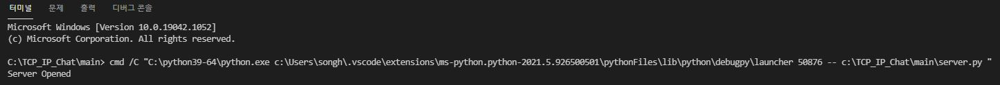
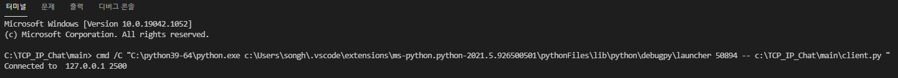
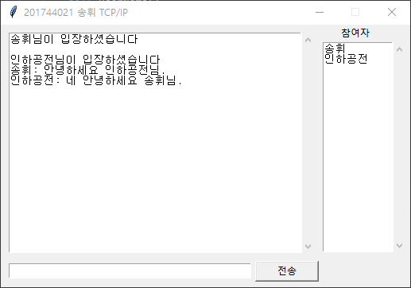
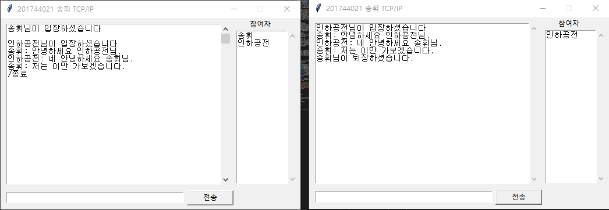

# 201744021 송휘 TCP/IP 기말고사 
## Chat program with multi-thread
> TCP/IP final exam report

<br/>

## 👨🏻‍💻 Overview  
    Python 기반의 multi-thread 활용 채팅 프로그램
[Server](https://github.com/songhwee1/TCP_IP_Chat/blob/main/main/server.py)와 [Client](https://github.com/songhwee1/TCP_IP_Chat/blob/main/main/client.py)로 이루어진 <b>다중 접속 채팅 프로그램</b> 입니다.


<br/>


## ✈️ Development Purpose
TCP/IP 강의시간에 배운 multi-thread의 개념을 활용하여 하나의 서버에 여러 명의 클라이언트가 접속하여 채팅을 주고 받을 수 있는 프로그램


<br/>


## ⚙ Design and Capabilities
<b>[Server](https://github.com/songhwee1/TCP_IP_Chat/blob/main/main/server.py)</b>와 <b>[Client](https://github.com/songhwee1/TCP_IP_Chat/blob/main/main/client.py)</b>로 구성됩니다.
<b>threading library</b>를 활용하여 <b>multi-thread</b>를 구현하였습니다.
<b>tkinter library</b>를 활용하여 <b>GUI</b>를 구성하였습니다.

#### Server.py

   - Class room : 채팅방 유저 관리
   
       def addClient : 채팅방에 사용자를 추가
       
       def delClient : 채팅방에서 사용자를 삭제
       
       def sendMsgAll : 모두에게 message 전송
 
   - Class chatClient : Client와의 통신을 담당
   
       def recv : while문을 통하여 data수신 및 수신값에 따른 결과 실행 ('/종료': 퇴장 및 클라이언트 삭제)
       
       def refreshClient: Client가 접속/퇴장 할때마다 Client목록 최신화
       
       def send : 모든 클라이언트에게 data 전송
    
   - Class chatServer : server IP address, port 설정 및 server 실행
   
       def open : 설정된 IP address와 port 값으로 TCP socket server 실행
       
       def run : open method 실행 및 thread 할당
       
#### Client.py

   - Class chatClient : client의 server 접속 및 통신을 담당
   
       def conn : server 접속 시도
       
       def ui : GUI 구성
       
       def userName : 최초 접속시 사용할 이름을 선택하는 팝업 형식의 GUI
       
       def setUserName : 최초 입력 값을 이름으로 설정
       
       def send : 입력한 data를 server로 전송
       
       def recv : server 에서 data 수신 및 화면에 표시(채팅 내용, 접속 인원)
       
       def run : conn, userName, ui method 실행 및 thread 할당


<br/>


## 💡 Distinction
- 버튼 클릭이 아닌 Enter 키 입력을 통해서도 data 전송 가능
- 최초 접속 시 팝업창에서 닉네임(사용할 이름) 할당
- 새로운 client 접속 시 알림
- 접속중인 client 목록 표시
- '/종료' 입력 시 알림 및 종료

<br/>


## 🖥 Launch Screen
- server 실행시



- client 실행시



- 닉네임 설정 화면


- 메인 화면



- '/종료' 입력시




<br/>


## ⛏ To - Do
끝말잇기 게임
- txt 파일에 dataset 제작
- '/시작'을 입력하여 게임 시작
- 1인 플레이는 정상적으로 진행됨
- 다른 client들과 연동되지 않는 issue 발생. 


<br/>


## 🔧 Tech

Language :  
```
Python 3.9.2
```

BE(Back-End) :
```
Python 3.9.2
```

FE(Front-End) :
```
Python 3.9.2 (tkinter)
```


